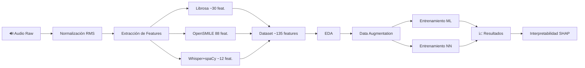

# 🧠 TFM_Process: Detección de Deterioro Cognitivo mediante Análisis de Voz

[](https://python.org)
[](https://jupyter.org)
[](https://www.terraform.io)
[](https://aws.amazon.com)
[](https://azure.microsoft.com)

> **Trabajo de Fin de Máster** — Máster en Big Data e Inteligencia Artificial

Repositorio completo del TFM enfocado en la **detección temprana de demencia y enfermedades neurodegenerativas** (Alzheimer) a partir del análisis multimodal de la voz y el lenguaje. El sistema procesa bases de datos clínicas (ADReSSo21/DementiaBank, BioHermes, Ivanova Dataset), extrae cientos de biomarcadores acústicos, espectrales, prosódicos y lingüísticos, y los introduce en modelos predictivos de Machine Learning y Deep Learning.

---

## 📂 Estructura del Repositorio

```
TFM_Process-main/
│
├── 📁 data/                        # Datos del proyecto (arquitectura medallón)
│   ├── bronze/                     #   └── Datos raw originales (audio_features_ivanova_dataset.csv)
│   ├── silver/                     #   └── Datos procesados y aumentados (data_aumentada_castellano.csv)
│   └── README.md
│
├── 📁 data_analysis/               # Análisis Exploratorio de Datos (EDA)
│   ├── data_analysis.ipynb         #   └── Notebook con EDA completo del dataset Ivanova
│   └── README.md
│
├── 📁 data_augmentation/           # Aumento de Datos Sintéticos
│   ├── data_augmentation_castellano.ipynb  # Generación de datos sintéticos (KNN, GMM)
│   └── README.md
│
├── 📁 data_engineer/               # Ingeniería de Datos y Cloud
│   ├── scripts/                    #   └── Scripts de extracción y procesamiento de audio
│   │   ├── Process_Parametros_.py          # ⭐ Script principal de extracción masiva
│   │   ├── single_audio_pipeline.py        # Pipeline para un solo audio
│   │   ├── 01_EDA_basico.py                # EDA automatizado
│   │   ├── 02_train_basic_models.py        # Entrenamiento de modelos base
│   │   ├── Process_OpenSmile_DE.py         # Procesamiento OpenSMILE
│   │   ├── analisis_json.py                # Análisis de JSON resultantes
│   │   └── recopila_info_json_ADReSSo21.py # Recopilación info ADReSSo21
│   ├── cloud/                      #   └── Arquitectura medallón cloud (Bronze → Silver → Gold)
│   ├── terraform/                  #   └── Infraestructura como Código
│   │   ├── AWS/                            # Despliegue en Amazon Web Services
│   │   └── AZURE/                          # Despliegue en Microsoft Azure
│   ├── docs/                       #   └── Documentación técnica del proyecto
│   ├── requirements.txt
│   └── README.md
│
├── 📁 ML_models/                   # Modelos de Machine Learning
│   └── Analysis_tfm_spanish.ipynb  #   └── Notebook con modelos ML (CatBoost, Random Forest, etc.)
│
├── 📁 neural_network/              # Redes Neuronales / Deep Learning
│   └── Analysis_tfm_NN_castellano.ipynb  # Notebook con redes neuronales (Keras)
│
├── 📁 results/                     # Resultados, modelos entrenados y visualizaciones
│   ├── ramdom_forest.joblib                # Modelo Random Forest serializado
│   ├── nnet.keras                          # Red neuronal entrenada (Keras)
│   ├── Analysis_tfm_spanish.pdf            # Informe PDF de modelos ML
│   ├── Analysis_tfm_NN_castellano.pdf      # Informe PDF de redes neuronales
│   ├── R0C_curve_rf.png                    # Curva ROC del Random Forest
│   ├── matriz_confusion_rf.png             # Matriz de confusión
│   ├── mean_shap_value.png                 # Valores SHAP medios
│   ├── shap_value_impact_on_model_ou*.png  # Impacto SHAP en el modelo
│   ├── shap_waterfall_class0.png           # Waterfall SHAP clase 0
│   ├── shap_waterfall_class1.png           # Waterfall SHAP clase 1
│   └── instances_shap.png                  # Instancias SHAP
│
└── README.md                       # ← Este archivo
```

---

## 🏗️ Arquitectura del Sistema

El proyecto sigue una **arquitectura de datos medallón** (Bronze → Silver → Gold) tanto en la organización local como en el despliegue cloud:

```
┌─────────────────────────────────────────────────────────────────────────────┐
│                        PIPELINE DE PROCESAMIENTO                            │
├─────────────────────────────────────────────────────────────────────────────┤
│                                                                             │
│  🔊 Audio (.wav)                                                            │
│     │                                                                       │
│     ▼                                                                       │
│  ┌──────────────────────┐                                                   │
│  │  BRONZE (Raw Data)   │  Normalización RMS, evaluación de calidad,        │
│  │                      │  descarte de audios deficientes                   │
│  └──────────┬───────────┘                                                   │
│             ▼                                                               │
│  ┌──────────────────────────────────────────────────────────────┐           │
│  │  SILVER (Feature Extraction)                                 │           │
│  │  ┌─────────────┐  ┌──────────────┐  ┌────────────────────┐  │           │
│  │  │   Librosa   │  │  OpenSMILE   │  │ Whisper + spaCy    │  │           │
│  │  │  ~30 feat.  │  │  eGeMAPSv02  │  │  Transcripción +   │  │           │
│  │  │  MFCCs,     │  │  88 feat.    │  │  Análisis NLP      │  │           │
│  │  │  pitch,     │  │  clínicas    │  │  ~12 feat.         │  │           │
│  │  │  jitter...  │  │              │  │                    │  │           │
│  │  └─────────────┘  └──────────────┘  └────────────────────┘  │           │
│  └──────────┬───────────────────────────────────────────────────┘           │
│             ▼                                                               │
│  ┌──────────────────────┐                                                   │
│  │  GOLD (ML-Ready)     │  ~135 características esenciales                  │
│  │                      │  JSON estructurado → Modelos ML/DL               │
│  └──────────────────────┘                                                   │
└─────────────────────────────────────────────────────────────────────────────┘
```

### Infraestructura Cloud (Terraform)

El proyecto incluye despliegue automatizado mediante **Terraform** en dos proveedores:

| Componente | AWS | Azure |
|:-----------|:---:|:-----:|
| Almacenamiento | S3 | Blob Storage |
| Computación | Lambda / SageMaker | App Service / Functions |
| Analítica | Glue / Athena | Data Factory / Synapse |
| ML/IA | SageMaker | Azure ML |
| Seguridad | IAM / KMS | Key Vault / IAM |

Cada proveedor incluye archivos organizados: `main.tf`, `storage.tf`, `compute.tf`, `analytics.tf`, `ml.tf`, `security.tf`, `variables.tf` y `outputs.tf`.

---

## 🔬 Módulos del Proyecto

### 1. `data/` — Datos (Arquitectura Medallón)

- **`bronze/`**: Dataset crudo original (`audio_features_ivanova_dataset.csv`) con +50 características por sujeto: metadatos demográficos, métricas acústicas (F0, jitter, shimmer, HNR…), métricas lingüísticas (TTR, sentence_length, noun_ratio…) y métricas clínicas (MMSE, años de escolaridad).
- **`silver/`**: Dataset procesado, limpio y aumentado (`data_aumentada_castellano.csv`), listo para entrenar modelos de ML.

### 2. `data_analysis/` — Análisis Exploratorio (EDA)

Notebook `data_analysis.ipynb` con análisis completo:
- Estadísticas descriptivas y distribución de variables
- Análisis de la variable dependiente (demencia: 3 categorías)
- Detección de valores faltantes y outliers (IQR)
- Visualizaciones: histogramas, box plots, pie charts

### 3. `data_augmentation/` — Aumento de Datos

Notebook `data_augmentation_castellano.ipynb` que implementa:
- Clase personalizada `MedicalDataAugmentor` (KNN + interpolación con perturbación gaussiana)
- Generación de hasta 2000 muestras sintéticas balanceadas
- Validación de calidad estadística de los datos generados
- Entrenamiento comparativo con: Logistic Regression, Decision Tree, Random Forest, XGBoost, LightGBM, SVM, KNN, Stacking
- Optimización de hiperparámetros (GridSearchCV, RandomizedSearchCV) y selección de features (SelectKBest, RFE)

### 4. `data_engineer/` — Ingeniería de Datos y Pipelines

#### Scripts principales

| Script | Función |
|:-------|:--------|
| `Process_Parametros_.py` | ⭐ Extracción masiva por lotes (ADReSSo21/DementiaBank) |
| `single_audio_pipeline.py` | Pipeline integral para un solo audio |
| `01_EDA_basico.py` | EDA automatizado con gráficos |
| `02_train_basic_models.py` | Entrenamiento de modelos base |
| `Process_OpenSmile_DE.py` | Procesamiento específico OpenSMILE |
| `analisis_json.py` | Análisis de resultados JSON |
| `recopila_info_json_ADReSSo21.py` | Recopilación de información ADReSSo21 |

#### Características específicas para demencia

| Característica | Tipo | Descripción |
|:--------------|:-----|:------------|
| `Skewness_pause_duration` | Audio | Asimetría de la distribución de pausas |
| `Kurtosis_pause_duration` | Audio | Curtosis de la distribución de pausas |
| `Filler_frequency` | Texto | Frecuencia de muletillas (um, uh, er…) |
| `Local_coherence` | Texto | Coherencia semántica entre frases adyacentes |
| `Lexical_errors` | Texto | Frecuencia de errores léxicos (OOV) |

#### Documentación técnica (`docs/`)
- `CARACTERISTICAS.md` — Documentación de todas las características
- `GUIA_USO.md` — Guía detallada de uso
- `ESTRUCTURA_PROYECTO.md` — Organización del proyecto
- `IMPLEMENTACION_NUEVAS_FEATURES.md` — Implementación paso a paso de las 5 nuevas features
- `MEMORIA_TFM.md` — Memoria del TFM
- `Arquitectura Medallion.png` — Diagrama de la arquitectura

### 5. `ML_models/` — Modelos de Machine Learning

Notebook `Analysis_tfm_spanish.ipynb`:
- Modelos de clasificación (CatBoost, Random Forest, etc.)
- Validación cruzada y métricas de rendimiento
- Exploración de las características predictivas más importantes
- Análisis SHAP para interpretabilidad del modelo

### 6. `neural_network/` — Redes Neuronales

Notebook `Analysis_tfm_NN_castellano.ipynb`:
- Diseño y entrenamiento de redes neuronales con Keras
- Evaluación de rendimiento en fase de test

### 7. `results/` — Resultados y Modelos Entrenados

- **Modelos serializados**: `ramdom_forest.joblib` (Random Forest), `nnet.keras` (Red Neuronal)
- **Informes PDF**: Análisis completo de ML y redes neuronales
- **Visualizaciones SHAP**: Mean values, waterfall plots por clase, impacto en el modelo
- **Métricas**: Curva ROC, matriz de confusión del Random Forest

---

## 🛠️ Tecnologías y Librerías

### Procesamiento de Audio
| Librería | Uso |
|:---------|:----|
| `librosa` | MFCCs, espectrales, pitch, RMS, Zero-Crossing Rate, F0, deltas |
| `opensmile` | Perfil `eGeMAPSv02` (88 features clínicas): shimmer, jitter, spectral slope |
| `soundfile` | Lectura/escritura de archivos `.wav` |
| `ffmpeg` | Decodificación de formatos de audio |

### Reconocimiento de Voz (ASR) y NLP
| Librería | Uso |
|:---------|:----|
| `whisper` (OpenAI) | Transcripción automática con timestamps |
| `spaCy` | POS tagging, sentencizer, análisis de coherencia |
| `textstat` | Métricas de legibilidad (Flesch-Kincaid) |
| `wordfreq` | Detección de errores léxicos y rareza de palabras |

### Machine Learning y Deep Learning
| Librería | Uso |
|:---------|:----|
| `catboost` | Gradient Boosting Trees con soporte categórico nativo |
| `scikit-learn` | Modelos, métricas, PCA, validación cruzada |
| `xgboost` | Extreme Gradient Boosting |
| `lightgbm` | Light Gradient Boosting Machine |
| `keras` / `tensorflow` | Redes neuronales |
| `shap` | Interpretabilidad de modelos (SHAP values) |

### Análisis y Visualización
| Librería | Uso |
|:---------|:----|
| `pandas` / `numpy` | Manipulación de datos tabulares |
| `scipy` | Análisis estadístico (asimetría, curtosis) |
| `matplotlib` / `seaborn` | Gráficos EDA, ROC, matrices de confusión |

### Infraestructura
| Tecnología | Uso |
|:-----------|:----|
| `Terraform` | Infraestructura como Código (AWS y Azure) |
| `AWS` (S3, Lambda, SageMaker, Glue) | Despliegue cloud en Amazon |
| `Azure` (Blob, Functions, ML, Data Factory) | Despliegue cloud en Microsoft |

---

## 🚀 Inicio Rápido

### 1. Clonar el repositorio

```bash
git clone https://github.com/<usuario>/TFM_Process.git
cd TFM_Process-main
```

### 2. Instalar dependencias

```bash
pip install -r data_engineer/requirements.txt
python -m spacy download en_core_web_md
```

### 3. Procesar un solo audio

```bash
python data_engineer/scripts/single_audio_pipeline.py
```

### 4. Procesamiento masivo (ADReSSo21)

```bash
python data_engineer/scripts/Process_Parametros_.py
```

### 5. EDA y entrenamiento

```bash
python data_engineer/scripts/01_EDA_basico.py
python data_engineer/scripts/02_train_basic_models.py
```

### 6. Notebooks (Jupyter)

```bash
jupyter notebook
```

Abrir los notebooks en orden recomendado:
1. `data_analysis/data_analysis.ipynb` — EDA
2. `data_augmentation/data_augmentation_castellano.ipynb` — Aumento de datos
3. `ML_models/Analysis_tfm_spanish.ipynb` — Modelos ML
4. `neural_network/Analysis_tfm_NN_castellano.ipynb` — Redes neuronales

---

## 📊 Flujo de Trabajo Completo



---

## ⚙️ Requisitos del Sistema

- **Python** ≥ 3.8
- **FFmpeg** instalado en el sistema
- **GPU** (opcional, recomendado para Whisper y redes neuronales)
- **RAM** ≥ 8 GB recomendado para procesamiento de audio

### Dependencias principales (`requirements.txt`)

```
librosa==0.10.1
soundfile==0.12.1
opensmile==2.5.0
pandas==2.1.4
numpy==1.26.2
spacy==3.7.2
openai-whisper==20231117
ffmpeg-python==0.2.0
scipy==1.11.4
```

---

## ⚠️ Notas Importantes

- Los datos contienen información sensible de pacientes (edad, género, métricas cognitivas). Asegurar cumplimiento de **GDPR/HIPAA**.
- Los archivos de audio originales (.wav) no se incluyen en el repositorio por motivos de privacidad y tamaño.
- Las rutas de los archivos CSV deben ajustarse según el entorno de ejecución.
- El balance de clases debe considerarse en el entrenamiento; el módulo de data augmentation aborda este problema.

---

## 📄 Licencia

Proyecto académico — Trabajo de Fin de Máster en Big Data e Inteligencia Artificial.

---

*Última actualización: Marzo 2026*
