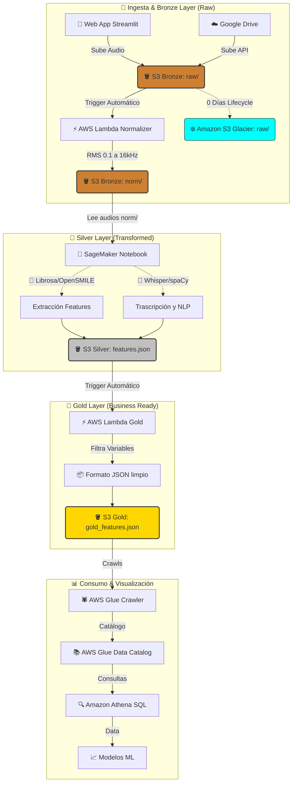

# ☁️ TFM Cloud Architecture - AWS Medallion

Implementación de la arquitectura AWS nativa para procesamiento de audio y detección de demencia.

**Región AWS**: `eu-central-1` (Frankfurt)

---

## 📁 Estructura

```
cloud/
├── bronze/          # Capa Bronze - Almacenamiento de audios RAW
├── silver/          # Capa Silver - Transcripción y extracción de features
├── gold/            # Capa Gold - Datos transformados en Parquet
└── orchestration/   # Orquestación con Lambda y Step Functions
```

---

## 🗺️ Mapa de Arquitectura (Medallion)

Esta arquitectura sigue el patrón **Bronze-Silver-Gold** para transformar datos crudos en insights valiosos, todo centralizado en AWS.



### Explicación del Flujo

1.  **🥉 Bronze Layer (Raw)**:
    *   La Web App (o la API de Drive) sube los `.wav` originales a S3 en `raw/`.
    *   S3 congela los archivos crudos en `Glacier` la misma noche para ahorrar costes.
    *   Una Lambda desencadenada automáticamente normaliza el audio al momento y lo guarda en `norm/`.

2.  **🥈 Silver Layer (Refined)**:
    *   El Notebook de SageMaker lee **únicamente** los audios limpios de la subcarpeta `norm/`.

3.  **🥇 Gold Layer (Curated)**:
    *   **AWS Glue (ETL)** cruza features acústicas con transcripciones y metadatos clínicos.
    *   Limpia, agrega y optimiza los datos en formato **Parquet** (columnar y comprimido).
    *   Particiona los datos para consultas eficientes.

4.  **📊 Capa de Visualización (Athena)**:
    *   Un **Glue Crawler** cataloga automáticamente los archivos Parquet.
    *   **Athena** permite consultar estos archivos usando SQL estándar (Serverless).
    *   Desde aquí conectas herramientas de BI (QuickSight) o Notebooks de Ciencia de Datos.

---

## 🚀 Orden de Implementación

1. **Bronze**: Crear buckets y subir audios
2. **Silver (Lambda)**: Transcripción automática con Whisper
3. **Silver (SageMaker)**: Extracción de features acústicas
4. **Gold**: ETL con Glue/Spark
5. **Catalog**: Configurar catálogo y queries

---

## 💰 Costos Estimados

| Servicio | Configuración | Costo/mes |
|----------|--------------|-----------|
| S3 | 5 GB storage | $0.12 |
| Lambda | 1 GB RAM, 100 invocaciones | $0.20 |
| SageMaker | ml.m5.large, 2 horas | $0.46 |
| Glue | 10 DPU-hours | $0.44 |
| **Total** | Primera ejecución | **~$1.22** |

---

Consulta los subdirectorios para scripts específicos de cada capa.
